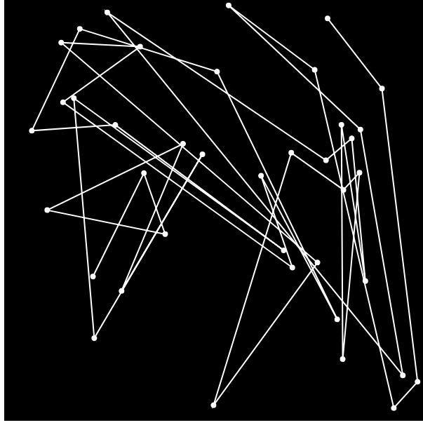

<h1>Travel Salesman Problem using GRASP </h1>

Greedy randomized adaptive search procedure is a metaheuritic to solve optimisation problems ,i'm making the comparison between the using grasp method and brute force alternative to search for an optimal path.

